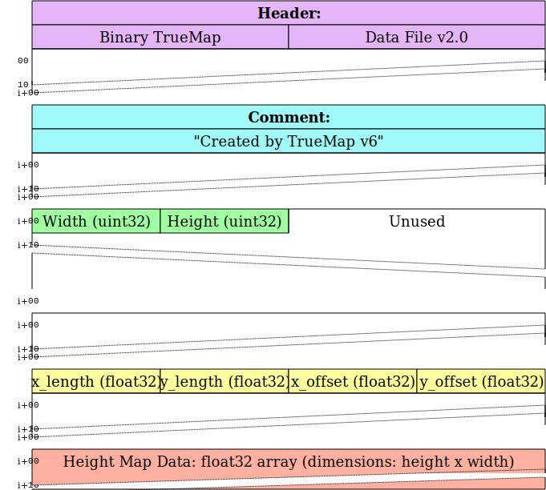

# TrueMap & GelSight TMD Processor

A Python-based TMD file processor with visualization and export capabilities for height maps stored in TMD files generated by
**TrueMap v6** or **GelSight**. The tool includes comprehensive features for data processing, visualization, and export to various formats.



---

## Table of Contents

- [Features](#features)
- [Installation](#installation)
- [Usage](#usage)
- [TMD File Format](#tmd-file-format)
  - [TrueMap v6 Format](#truemap-v6-format)
  - [GelSight Format](#gelsight-format)
- [License](#license)

---

## Features

- **Automatic Format Detection:** Auto-detects TMD file format and endianness
- **Rich Visualizations:**
  - Interactive 3D surface plots with adjustable Z-scale
  - 2D heatmaps using Plotly, Matplotlib, or Seaborn
  - X-profile cross-section plots
- **Multiple Export Formats:**
  - Displacement maps (grayscale PNG)
  - Normal maps (RGB PNG)
  - Bump maps with adjustable parameters
  - Ambient Occlusion (AO) maps
  - BSRF (Bidirectional Scattering Reflection Function) maps
  - Multi-channel maps (RGBE, RG formats)
  - STL files for 3D printing (ASCII or binary)
  - NumPy data formats (.npy, .npz)
- **Modern CLI Interface:** Rich command line experience using Typer and Rich
- **Well-Tested:** Comprehensive test suite with high coverage

---

## Installation

### Quick Install
```

Ensure you have Python 3.12+ installed. Then, install the required packages:

```bash
pip install numpy plotly pillow
```

Clone the repository and navigate into the project directory

## Usage

Run the main script to process TMD files:

```bash
python tmd_processor.py
```

You can also run the provided Jupyter Notebook to see step-by-step examples.

---

## TMD File Format

The TMD files processed by this tool follow a binary layout with similar structures for both TrueMap v6 and GelSight versions. The main difference lies in the comment field and the typical source of the file.

### TrueMap v6 Format

1. **Header (32 bytes):**
   An ASCII string that starts with:
   `Binary TrueMap Data File v2.0`

2. **Comment (Variable, up to 256 bytes):**
   A null-terminated string, typically:
   `Created by TrueMap v6`

3. **Dimensions (8 bytes):**
   Two 32-bit unsigned integers for **width** and **height** (little-endian).

4. **Spatial Information (16 bytes):**
   Four 32-bit floats representing:
   - **x_length** (physical length in X)
   - **y_length** (physical length in Y)
   - **x_offset**
   - **y_offset**

5. **Height Map Data:**
   A sequence of 32-bit floats (4 bytes each) forming a 2D array with dimensions **height x width**.

### GelSight Format

The GelSight TMD file format is very similar to the TrueMap v6 format with subtle differences:

1. **Header (32 bytes):**
   The header string is the same:
   `Binary TrueMap Data File v2.0`

2. **Comment (Variable):**
   A null-terminated string that may be empty or contain different metadata.

3. **Dimensions (8 bytes):**
   Two 32-bit unsigned integers for **width** and **height** (little-endian).

4. **Spatial Information (16 bytes):**
   Four 32-bit floats for:
   - **x_length**
   - **y_length**
   - **x_offset**
   - **y_offset**

5. **Height Map Data:**
   A float32 array representing the height values over a grid defined by the width and height.

The processor uses the file name (or structure hints) to choose the appropriate parser for TrueMap v6 or GelSight TMD files.

---

## License

This project is licensed under the MIT License. See the [LICENSE](LICENSE) file for details.
