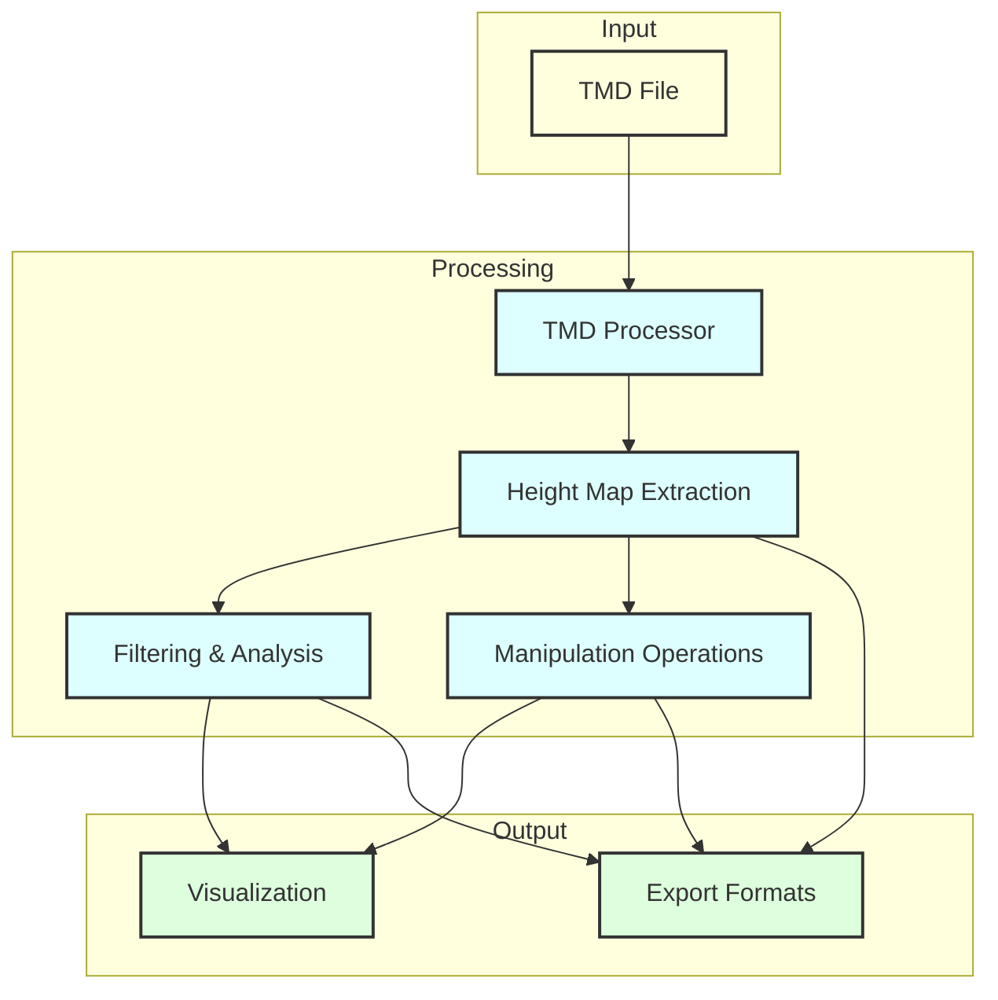
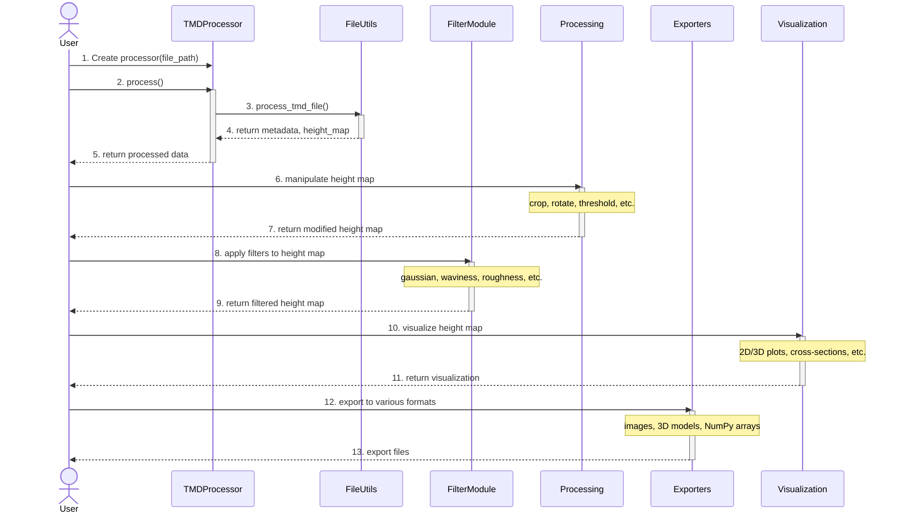

# TMD Architecture: Component Diagram

This document provides a visual representation of the TMD library's architecture, showing the key components and their relationships.

## Component Overview

```mermaid
graph TD
    User[User/Application] --> Processor
    
    subgraph Core
        Processor[TMDProcessor]
        Utils[FileUtils]
    end
    
    subgraph Processing
        Filter[FilterModule]
        Processing[ProcessingModule]
    end
    
    subgraph Visualization
        MatPlotLib[MatplotlibPlotter]
        Plotly[PlotlyPlotter]
    end
    
    subgraph Export
        ImageExporter[ImageExporter]
        ModelExporter[3DModelExporter]
        CompressionExporter[CompressionExporter]
    end
    
    Processor --> Utils
    Processor --> Processing
    Processor --> Filter
    
    Processing --> Filter
    
    Processor --> MatPlotLib
    Processor --> Plotly
    
    Processor --> ImageExporter
    Processor --> ModelExporter
    Processor --> CompressionExporter
    
    classDef core fill:#f96,stroke:#333,stroke-width:2px;
    classDef processing fill:#9cf,stroke:#333,stroke-width:2px;
    classDef visualization fill:#f9f,stroke:#333,stroke-width:2px;
    classDef export fill:#9f9,stroke:#333,stroke-width:2px;
    
    class Processor,Utils core;
    class Filter,Processing processing;
    class MatPlotLib,Plotly visualization;
    class ImageExporter,ModelExporter,CompressionExporter export;
```

## Data Flow Diagram



## Processing Sequence

This sequence diagram shows the complete process flow when using the TMD library:



## Component Descriptions

### Core Components
- **TMDProcessor**: Main class for loading and processing TMD files
- **FileUtils**: Handles file I/O operations and TMD format parsing

### Processing Components
- **FilterModule**: Implements various filters and analysis algorithms
- **ProcessingModule**: Provides tools for manipulating height maps

### Visualization Components
- **MatplotlibPlotter**: Creates static visualizations using Matplotlib
- **PlotlyPlotter**: Creates interactive visualizations using Plotly

### Export Components
- **ImageExporter**: Exports height maps to various image formats
- **ModelExporter**: Exports height maps to 3D model formats (STL, OBJ, PLY)
- **CompressionExporter**: Exports height maps to NumPy formats
