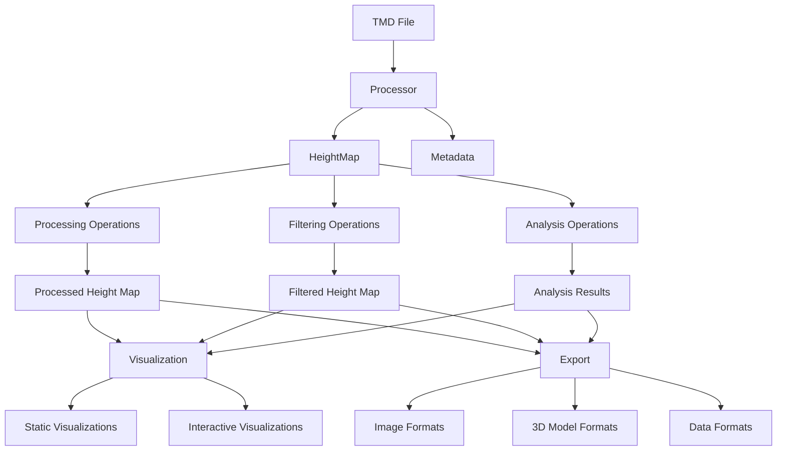
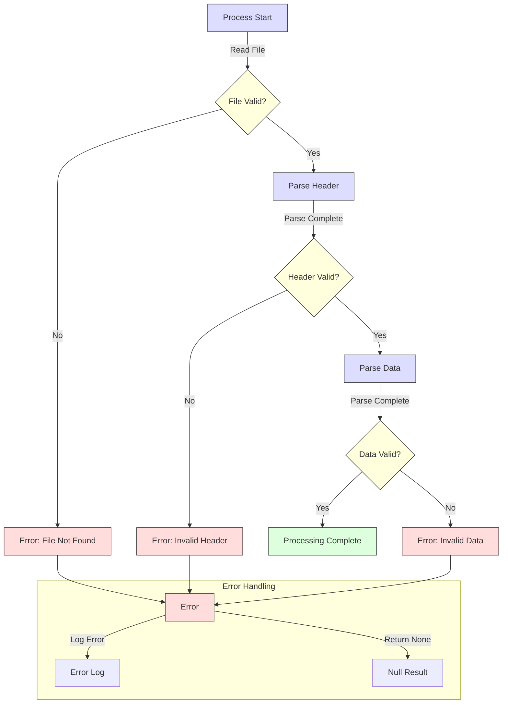
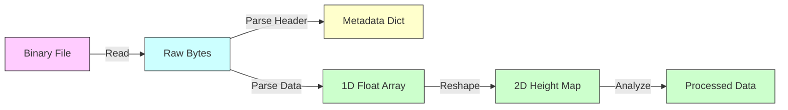
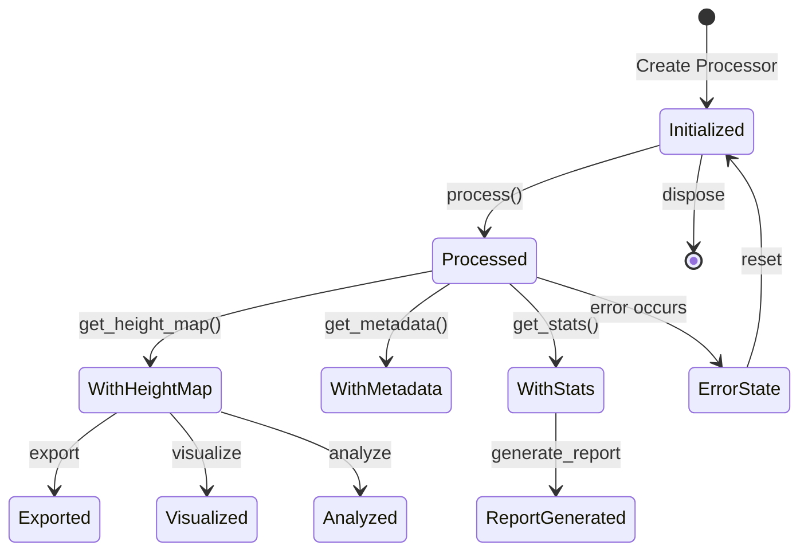

# TMD Data Flow

This document outlines the data flow through the TMD library, showing how data moves between different components during typical operations.

## Core Data Flow Sequence

The standard data flow through the TMD library follows this sequence:



## Key Data Objects

### TMD File

The starting point - a binary file containing:

- Height map data
- Metadata about physical dimensions
- File format information

### Processed Data

After parsing the TMD file, the data is represented as:

1. **Height Map**: A 2D NumPy array of floating-point values representing surface heights
2. **Metadata**: A dictionary containing information like:
   - Physical dimensions (width, height)
   - Units (µm, nm, etc.)
   - Comments from the original file
   - File format version

## Processing Pipeline

A typical processing pipeline looks like this:

1. **Load TMD File**: The processor loads and parses the binary TMD file
2. **Extract Height Map**: The height map is extracted and converted to a NumPy array
3. **Process/Filter**: Various operations can be applied to the height map
   - Gaussian filtering for smoothing
   - Thresholding for outlier removal
   - Cropping for region-of-interest analysis
4. **Analysis**: Calculate metrics like roughness or extract cross-sections
5. **Visualization**: Create visual representations of the data
6. **Export**: Save the results in various formats

## Data Transformations

Throughout the pipeline, the height map undergoes various transformations:

1. **Initial Processing**:
   - Raw binary data → NumPy array
   - Metadata extraction

2. **Height Map Operations**:
   - Filtering (Gaussian, median, etc.)
   - Geometric operations (crop, rotate)
   - Statistical operations (normalize, threshold)

3. **Export Transformations**:
   - Height map → Displacement map (grayscale image)
    P3[Section Location] -.->|Configure| D
    end

```

## Error Handling Flow

This diagram shows how errors are handled during processing:



## Data Type Flow

This diagram shows how data types flow through the system:



## State Diagram for TMDProcessor

This diagram shows the state transitions of a TMDProcessor object:



These diagrams provide a comprehensive view of how data flows through the TMD library, helping users understand its architecture and processing pipeline.
