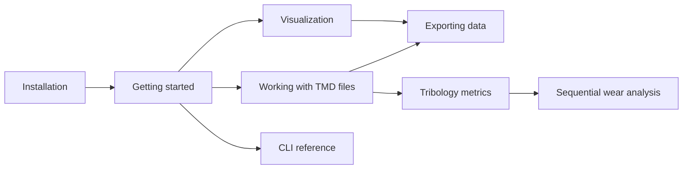
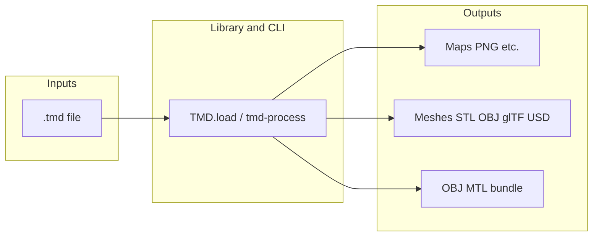

# TrueMap Data (TMD)

**TrueMap Data** is a small binary format for **height maps** from **TrueMap v6** and **GelSight**-class instruments. This project provides a **Python library** and two CLIs: **`tmd-process`** (maps, mesh, sequences, defects, tribology dashboard, and related workflows) and **`tmd-wear`** (bearing curve, wear volume series, roughness track, and other wear-oriented helpers). Both install from the same `truemapdata` package. Use them for loading `.tmd` files, visualizing surfaces, exporting texture-style maps, generating meshes (STL, OBJ, PLY, glTF, USD), and bundling maps onto template OBJ/MTL assets with physically motivated tiling.

**Who it is for:** tribology and metrology workflows, graphics pipelines that need displacement or normal maps from measured topography, and developers building tools on top of NumPy-friendly height arrays.

Apply-on-mesh uses physical tiling: template OBJ bounds (default meters) are converted with `OBJ_UNITS_TO_MM=1000` and combined with TMD `mm_per_pixel` to derive atlas and tile sizes. Details live in the [CLI reference](reference/cli.md) and [Exporting data](user-guide/exporting-data.md).

## Where to go next

## Links

- **Repository:** [github.com/ETSTribology/TrueMapData](https://github.com/ETSTribology/TrueMapData)
- **PyPI:** [pypi.org/project/truemapdata](https://pypi.org/project/truemapdata/)
- **This documentation site:** [etstribology.github.io/TrueMapData](https://etstribology.github.io/TrueMapData/)
- **README** (PyPI landing, short overview): [README on GitHub](https://github.com/ETSTribology/TrueMapData/blob/main/README.md)

## User guide

- [Installation](user-guide/installation.md)
- [Getting started](user-guide/getting-started.md)
- [Working with TMD files](user-guide/working-with-tmd-files.md)
- [Visualization](user-guide/visualization.md)
- [Exporting data](user-guide/exporting-data.md)
- [Tribology metrics](user-guide/tribology-metrics.md)
- [Sequential wear analysis](user-guide/sequential-wear-analysis.md) — aligned stacks, volume series, slip axis, scratch evolution, `tmd-wear`

## Reference

- [CLI](reference/cli.md)

## Developers

- [Contributing](developers/contributing.md)
- [Building the docs](developers/building-docs.md)
- [Documentation style](developers/documentation-style.md)
- [AI assistants (llms.txt)](developers/ai-tooling.md)

## License

[MIT License](https://github.com/ETSTribology/TrueMapData/blob/main/LICENSE)
