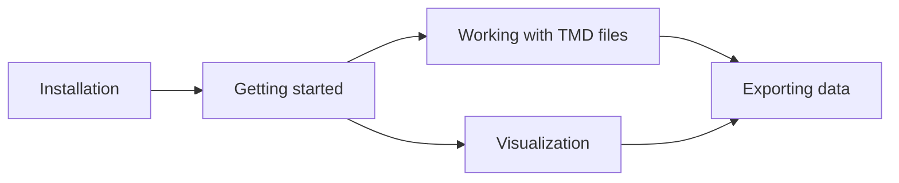

# TrueMap Data (TMD)

Python library and CLI for reading **TrueMap v6** and **GelSight** TMD height maps:
I/O, processing, visualization, texture-style map export, 3D mesh generation, and
apply-on-mesh OBJ/MTL bundling.

Apply-on-mesh uses physical tiling: template OBJ bounds (default meters) are converted with
`OBJ_UNITS_TO_MM=1000` and combined with TMD `mm_per_pixel` to derive atlas and tile sizes.

## Links

- **Repository:** [github.com/ETSTribology/TrueMapData](https://github.com/ETSTribology/TrueMapData)
- **PyPI:** [pypi.org/project/truemapdata](https://pypi.org/project/truemapdata/)
- **This documentation site:** [etstribology.github.io/TrueMapData](https://etstribology.github.io/TrueMapData/)
- **README** (install, CLI overview, format notes): [README on GitHub](https://github.com/ETSTribology/TrueMapData/blob/main/README.md)

## User guide

- [Installation](user-guide/installation.md)
- [Getting started](user-guide/getting-started.md)
- [Working with TMD files](user-guide/working-with-tmd-files.md)
- [Visualization](user-guide/visualization.md)
- [Exporting data](user-guide/exporting-data.md)

## License

[MIT License](https://github.com/ETSTribology/TrueMapData/blob/main/LICENSE)
