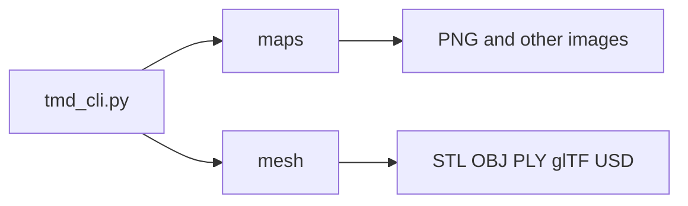

# Exporting data

The CLI groups exports into **texture-style height maps** (`maps`) and **3D meshes** (`mesh`). Both read a TMD height field and write files you can open in image viewers or CAD and DCC tools.



## Height maps and textures (`maps`)

From the repo root (or with `tmd-process` on your `PATH`):

```bash
python tmd_cli.py maps list
python tmd_cli.py maps height path/to/file.tmd --output-file height.png
```

Use `python tmd_cli.py maps --help` for subcommands and options.

## 3D mesh (`mesh`)

The `mesh` group exports a TMD height field to STL, OBJ, PLY, glTF/GLB, or USD.

```bash
# List supported model formats
python tmd_cli.py mesh formats

# One-shot STL export (uses quality preset defaults)
python tmd_cli.py mesh stl path/to/file.tmd

# Full control: method (adaptive | quadtree), quality, caps, quadtree depth
python tmd_cli.py mesh generate path/to/file.tmd --format stl --method adaptive --quality high
python tmd_cli.py mesh generate path/to/file.tmd --format stl --method quadtree --max-triangles 80000 --error-threshold 0.02 --max-subdivisions 10
```

**Adaptive** refines triangles where the surface deviates from a linear approximation; **`error_threshold`** (smaller → more detail) and **`max_triangles`** cap cost.

**Quadtree** subdivides a regular grid hierarchy; **`max_subdivisions`** limits depth. Use **`detail_boost`** (via the Python API `ExportConfig`) to bias subdivision.

Sample `.tmd` files are not shipped in the repository; use your own captures, the `terrain` CLI / `TMDTerrain` helpers for synthetic grids, or published examples.
