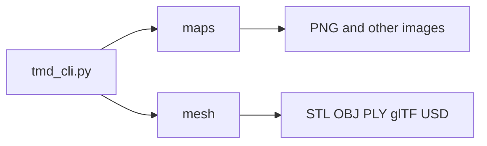

# Exporting data

The CLI groups exports into **texture-style height maps** (`maps`) and **3D meshes**
(`mesh`). Both read a TMD height field and write files you can open in image viewers
or CAD and DCC tools.



## Height maps and textures (`maps`)

From the repo root (or with `tmd-process` on your `PATH`):

```bash
python tmd_cli.py maps list
python tmd_cli.py maps height path/to/file.tmd --output-file height.png
```

Use `python tmd_cli.py maps --help` for subcommands and options.

## 3D mesh (`mesh`)

The `mesh` group exports a TMD height field to STL, OBJ, PLY, glTF/GLB, or USD.

```bash
# List supported model formats
python tmd_cli.py mesh formats

# One-shot STL export (uses quality preset defaults)
python tmd_cli.py mesh stl path/to/file.tmd

# Full control: method (adaptive | quadtree), quality, caps, quadtree depth
python tmd_cli.py mesh generate path/to/file.tmd --format stl --method adaptive --quality high
python tmd_cli.py mesh generate path/to/file.tmd --format stl --method quadtree --max-triangles 80000 --error-threshold 0.02 --max-subdivisions 10
```

**Adaptive** refines triangles where the surface deviates from a linear approximation;
**`error_threshold`** (smaller → more detail) and **`max_triangles`** cap cost.

**Quadtree** subdivides a regular grid hierarchy; **`max_subdivisions`** limits
depth. Use **`detail_boost`** (via the Python API `ExportConfig`) to bias subdivision.

Sample `.tmd` files are not shipped in the repository; use your own captures, the
`terrain` CLI / `TMDTerrain` helpers for synthetic grids, or published examples.

## Apply maps on existing mesh (`mesh apply`)

Use this separate flow when you already have an OBJ mesh (plane, sphere, or complex
model) and want TMD-derived maps bound in a deterministic OBJ/MTL bundle:

```bash
python tmd_cli.py mesh apply path/to/file.tmd \
  --output-dir ./bundle_out \
  --template-kind plane \
  --template-mesh ./template_plane/plane.obj \
  --obj-units-to-mm 1000 \
  --tmd-mm-per-pixel 0.05 \
  --mode uv
```

Template directory convenience (expects `plane.obj`):

```bash
python tmd_cli.py mesh apply path/to/file.tmd \
  --output-dir ./bundle_out \
  --template-plane-dir e:\\master\\TextureFriction\\notebook\\fixtures\\template_plane \
  --obj-units-to-mm 1000 \
  --mode uv
```

Mode behavior:

- `uv` (default): keep template geometry/UVs unchanged, bind maps in MTL.
- `displace`: opt-in displacement-ready binding via `map_disp` (geometry remains
  template-driven unless downstream tooling applies displacement).
- `--uv-alignment-mode preserve` (default) keeps original template UVs.
- Built-in templates: `--template-kind plane|sphere|cube`.

Output contract:

- One OBJ + one MTL bundle.
- One `textures/` folder.
- Relative texture references in MTL.
- Standard map keys: `map_Kd`, `map_Bump`, `map_disp`, `map_Pr`.

Physical sizing contract:

- Template OBJ bounds are read from vertex X/Z span and converted to mm with
  `--obj-units-to-mm` (default `1000`, for meters-based OBJ files).
- If `--tmd-mm-per-pixel` is omitted, `mm_per_pixel` is read from TMD metadata.
- Atlas and tile sizes are computed as:
  - `target_w_px = round(template_x_mm / tmd_mm_per_pixel)`
  - `target_h_px = round(template_z_mm / tmd_mm_per_pixel)`
  - `tile_w_px = round(tmd_x_length_mm / tmd_mm_per_pixel)`
  - `tile_h_px = round(tmd_y_length_mm / tmd_mm_per_pixel)`
- Capture maps are resampled to tile size, tiled, then cropped to atlas size.
