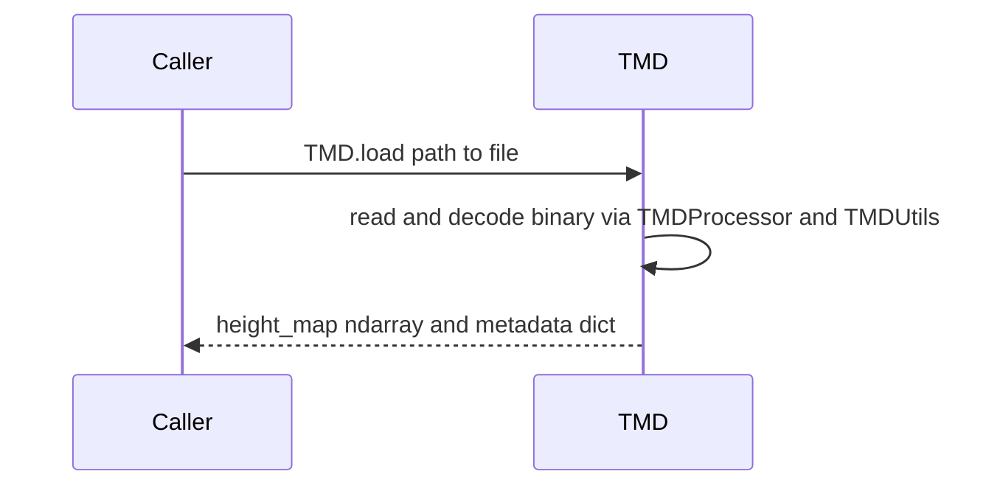

# Getting started

```python
from tmd import TMD

data = TMD.load("path/to/file.tmd")
height_map = data.height_map
metadata = data.metadata
```

`TMD.load` (or constructing `TMD("path.tmd")`) returns an object whose **`height_map`** is a 2D **`float32`** array shaped **`(height, width)`** and whose **`metadata`** holds dimensions, physical lengths, offsets, and version fields parsed from the file. For byte layout and version differences, see [Working with TMD files](working-with-tmd-files.md).



Use `path/to/file.tmd` with a real file from TrueMap or GelSight. The library does not include sample `.tmd` binaries in the git tree.

For CLI examples after `pip install truemapdata` (or `pip install -e .` from a clone):

```bash
tmd-process --help
tmd-process visualize examples
```

From a repository checkout you can also run **`python tmd_cli.py`** with the same subcommands if you prefer not to use the installed entry point.

Wear- and tribology-oriented helpers use the separate **`tmd-wear`** entry point; see [Working with TMD files — Wear-oriented CLI](working-with-tmd-files.md#wear-oriented-cli-tmd-wear), the [Sequential wear analysis](sequential-wear-analysis.md) guide (alignment, volume series, slip axis, scratch evolution), and the [CLI reference](../reference/cli.md).

A consolidated **`tmd-process`** command reference is in [CLI reference](../reference/cli.md).
