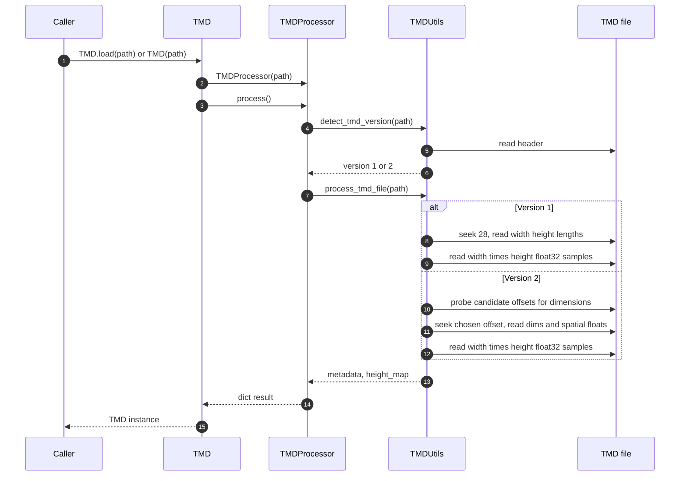
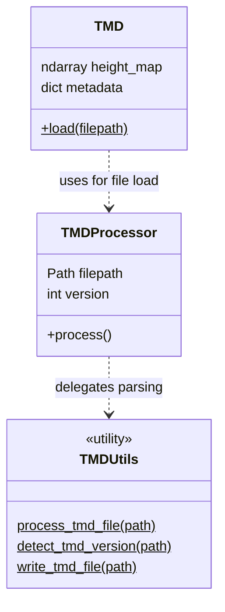
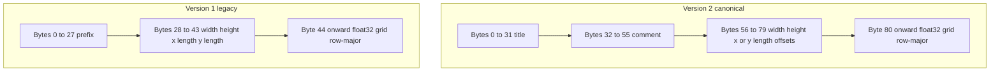

# Working with TMD files

TMD (**True Map Data**) is a small binary format: a fixed-size text header, numeric metadata, then a dense **row-major** grid of **`float32`** heights with logical shape **`(height, width)`** (NumPy/C order: first index is row / *y*, second is column / *x*).

The library reads **version 1** (legacy TrueMap) and **version 2** (TrueMap v6–style) through [`TMD.load`](getting-started.md) and the lower-level `tmd.utils.utils.TMDUtils` API.

**Reading this page:** The offset/size tables are the precise specification. The diagrams below summarize how a file is parsed in code, how the main classes relate, and how major byte regions abut on disk (including why numeric fields stay 4-byte aligned without extra padding).

---

## Quick usage

```python
from tmd import TMD

data = TMD.load("path/to/file.tmd")
height_map = data.height_map   # 2D float32 ndarray, shape (height, width)
metadata = data.metadata       # width, height, lengths, offsets, version, etc.
```

For direct I/O, `TMDUtils.process_tmd_file(path)`, `TMDUtils.write_tmd_file(...)`, and `TMDUtils.detect_tmd_version(path)` mirror what the high-level `TMD` object uses.

---

## Load path, classes, and disk layout

### Sequence: from file path to `height_map`



### Class relationships (high level)



### Contiguous regions and alignment

Regions are packed back-to-back. After the fixed text blocks, the first `uint32` (**width**) sits on a **4-byte boundary** (offset 56 for v2, 28 for v1), so every following `uint32` / `float32` read stays naturally aligned; the implementation does not insert pad bytes between those fields.



For **version 2**, writers should ensure `file_size` equals the header through the last metadata field plus exactly `width * height * 4` bytes of raster data. The reader’s offset probe checks that the implied grid length matches the remainder of the file, which rejects most wrong offsets when multiple candidates exist.

---

## Endianness and types

| Field kind | Storage | Notes |
|------------|---------|--------|
| **Width / height** | Two **little-endian** `uint32` values | Same order as `struct.pack("<II", width, height)` in Python |
| **Spatial metadata** | **Little-endian IEEE-754 `float32`** | Physical lengths and optional offsets in file units (typically mm) |
| **Height samples** | **`float32`**, **row-major** | `width × height` values; each row is `width × 4` contiguous bytes |

There is **no big-endian** variant in the reader: all multi-byte integers and floats are interpreted as **little-endian**.

---

## Field alignment (byte layout)

The format does **not** use extra alignment padding between metadata fields. After each fixed-size header block, the file offset is chosen so that **`uint32` and `float32` fields land on 4-byte boundaries**:

- **Version 1:** the first `uint32` (**width**) starts at **byte offset 28** (28 is a multiple of 4).
- **Version 2 (canonical):** **width** starts at **byte offset 56** (56 is a multiple of 4).

So a straightforward implementation can `read(4)` / `unpack("<I")` / `unpack("<f")` sequentially without inserting pad bytes between dimensions and spatial fields.

---

## Version 2 (TrueMap v6 canonical layout)

This is what `TMDUtils._write_v2_header` and `TMDUtils.write_tmd_file(..., version=2)` emit.

| Byte offset | Size | Content |
|-------------|------|---------|
| `0` | **32** | ASCII title, e.g. `Binary TrueMap Data File v2.0` followed by `\n\r`, **null-padded** or truncated to exactly **32 bytes** |
| `32` | **24** | ASCII **comment**, **null-padded** or truncated to exactly **24 bytes** |
| `56` | **4** | **Width** (`uint32`, LE) |
| `60` | **4** | **Height** (`uint32`, LE) |
| `64` | **4** | **x_length** (`float32`, LE) |
| `68` | **4** | **y_length** (`float32`, LE) |
| `72` | **4** | **x_offset** (`float32`, LE) |
| `76` | **4** | **y_offset** (`float32`, LE) |
| `80` | `width × height × 4` | Height grid: **`float32`**, row-major, shape **`(height, width)`** |

**Total file size (canonical v2):**

`80 + width × height × 4` bytes.

Version detection looks at the first bytes of the file: if the decoded header text contains **`v2.0`**, the reader treats the file as version **2** (`TMDUtils.detect_tmd_version`).

### Alternate v2 layouts

Some tools emit a **text header line** followed by **runs of `0x00` bytes** before the dimension block. The reader therefore **probes** a small set of candidate offsets (including the canonical **56**) and accepts the offset where **`width` and `height` are plausible** and the implied payload size matches the file length exactly (`_detect_v2_dimension_offset` in `tmd/utils/utils.py`). If you write new files, sticking to the **32 + 24 + metadata + grid** layout above is the most interoperable choice.

---

## Version 1 (legacy)

| Byte offset | Size | Content |
|-------------|------|---------|
| `0` | **28** | ASCII prefix `Binary TrueMap Data File\r\n`, **null-padded** to exactly **28 bytes** |
| `28` | **4** | **Width** (`uint32`, LE) |
| `32` | **4** | **Height** (`uint32`, LE) |
| `36` | **4** | **x_length** (`float32`, LE) |
| `40` | **4** | **y_length** (`float32`, LE) |
| `44` | `width × height × 4` | Height grid: **`float32`**, row-major |

**Offsets `x_offset` / `y_offset` are not stored** in v1; they default to **0** when reading. The reader seeks to **offset 28** before reading dimensions.

**Total file size (v1):**

`44 + width × height × 4` bytes.

---

## Height grid memory layout

- Indexing: **`height_map[row, col]`** with `row ∈ [0, height)` and `col ∈ [0, width)`.
- On disk, **row 0** appears first, then row 1, and so on; within each row, **column 0** appears first.
- This matches `numpy.ndarray` **`dtype=float32`**, **`order="C"`**, and **`tobytes()`** / **`frombuffer`** as used in `TMDUtils`.

---

## Inspecting raw bytes

For debugging or custom parsers, `TMDUtils.hexdump(data, width=16)` produces a conventional hex + ASCII view of any `bytes` object (see tests in `tests/utils/test_utils.py`).

---

## GelSight and other producers

Files that share the same **overall binary idea** (header text, dimensions, spatial fields, `float32` raster) may still differ in **comment text** or **exact header line endings**. The reader relies on **header/version heuristics** and, for v2, the **dimension-offset probe** described above. When in doubt, hex-dump the first **128 bytes** and compare offsets to the tables in this page.

---

## Roughness and topography (Surfalize)

[Surfalize](https://github.com/fredericjs/surfalize) is a Python library for **areal surface roughness** (ISO 25178 areal parameters: Sa, Sq, Sp, Sv, Sz, Ssk, Sku, Sdr, Sdq, Sal, Str, functional Sk family, volume metrics, and more), preprocessing (leveling, filters, alignment), and related plots. Parameter definitions and validation targets (e.g. Gwyddion, MountainsMap) are described in the [Surfalize README](https://github.com/fredericjs/surfalize). It reads and writes **TrueMap `.tmd`** directly, so you can analyze the same files this library loads with `TMD.load`. Upstream documentation: [surfalize.readthedocs.io](https://surfalize.readthedocs.io/en/latest/).

**License:** Surfalize is **GPL-3.0**; `truemapdata` itself is **MIT**. Installing the optional roughness stack pulls in GPL-licensed code—check your obligations before redistributing or combining it with proprietary software. Surfalize’s authors also recommend **validating results** against established tools for publication-grade work.

### CLI in this project (`tmd-process roughness`)

Install the optional extra (see [Installation](installation.md)):

```bash
pip install "truemapdata[roughness]"
```

**Single map** — by default, **`roughness file`** requests Surfalize’s full **ISO 25178** set (`Surface.ISO_PARAMETERS`: height, hybrid, spatial, functional, and volume parameters). Use **`--quick`** for only Sa, Sq, Sz, Ssk, Sku (faster on large maps). Use **`--all`** for every metric Surfalize exposes (ISO plus non-ISO extras such as periodic texture helpers). Use **`--params`** to override with a comma-separated list. Optional plane leveling remains on unless **`--no-level`**.

```bash
tmd-process roughness file path/to/map.tmd
tmd-process roughness file path/to/map.tmd --json
tmd-process roughness file path/to/map.tmd --quick --json
tmd-process roughness file path/to/map.tmd --params Sa,Sq,Sz --no-level
tmd-process roughness file path/to/map.tmd --all
```

If Surfalize’s built-in `.tmd` reader fails (for example **non-UTF-8 text in the header** on some GelSight exports), the CLI **loads the raster with this library** and builds the Surfalize surface from height data and scan lengths, so roughness still runs on any TMD `TMD.load` accepts.

**Many maps / sequence folder** — every `*.tmd` in a directory (e.g. frames after alignment), CSV output:

```bash
tmd-process roughness batch path/to/folder --output roughness.csv
tmd-process roughness batch path/to/folder --output roughness.csv --quick
tmd-process roughness batch path/to/folder --recursive --pattern "*.tmd"
```

Batch runs **sequentially** with the same load path as **`roughness file`** (including the TrueMapData fallback), and records a **`__error__`** column if a file fails. The **`--parallel`** flag is accepted for CLI compatibility but is ignored.

**Roughness vs time (ordered sequence)** — after alignment, frames have a natural order. Use **`roughness sequence`** so each row has a **`frame`** index (0 = first file) for plotting how Sa, Sq, etc. change over the sequence. Output includes **`path`** unless **`--no-path`**.

```bash
# Explicit frame order (recommended after align: pass paths in time order)
tmd-process roughness sequence frame0.tmd frame1.tmd frame2.tmd --output roughness_vs_frame.csv
tmd-process roughness sequence *.tmd --quick --json

# Or glob a folder: sorted by file name (default) or by mtime
tmd-process roughness sequence --from-dir path/to/aligned --pattern "*_aligned.tmd" --sort-by name --output trace.csv
tmd-process roughness sequence --from-dir path/to/aligned --sort-by mtime --quick --json
```

**Workflow with sequences:** `tmd-process sequence align …` writes aligned `*_aligned.tmd` frames into an output directory. Use **`roughness sequence --from-dir …`** (sorted by name or mtime) or pass aligned paths **in order** to **`roughness sequence`** to track roughness over time. Use **`roughness batch`** when you only need a parameter table without frame indices.

### Surfalize’s own CLI (reports, convert)

For PDF reports, conversion, or 3D previews, install Surfalize’s CLI extras and use the `surfalize` command ([upstream command-line docs](https://surfalize.readthedocs.io/en/latest/)):

```bash
pip install "surfalize[cli]"
surfalize report path/to/map.tmd
```

### Python API (Surfalize)

Individual surface:

```python
from surfalize import Surface

surface = Surface.load("path/to/file.tmd").level()
params = surface.roughness_parameters(["Sa", "Sq", "Sz"])
```

Many files (Surfalize `Batch`, not `TMDSequence`):

```python
from pathlib import Path
from surfalize import Batch

paths = sorted(Path("folder").glob("*.tmd"))
batch = Batch(str(p) for p in paths).level().roughness_parameters()
result = batch.execute(multiprocessing=True, ignore_errors=True)
df = result.get_dataframe()
```

`TMDSequence` in this library is for **alignment, cropping, and export** of height-map sequences; Surfalize’s **`Batch`** is for **parameter tables** over many topography files.

---

## Related topics

- **Roughness and topography (Surfalize)** — section above; optional install `truemapdata[roughness]`.
- Mesh export options (`ExportConfig`, triangulation): [Exporting data](exporting-data.md).
- First steps with the Python API: [Getting started](getting-started.md).
